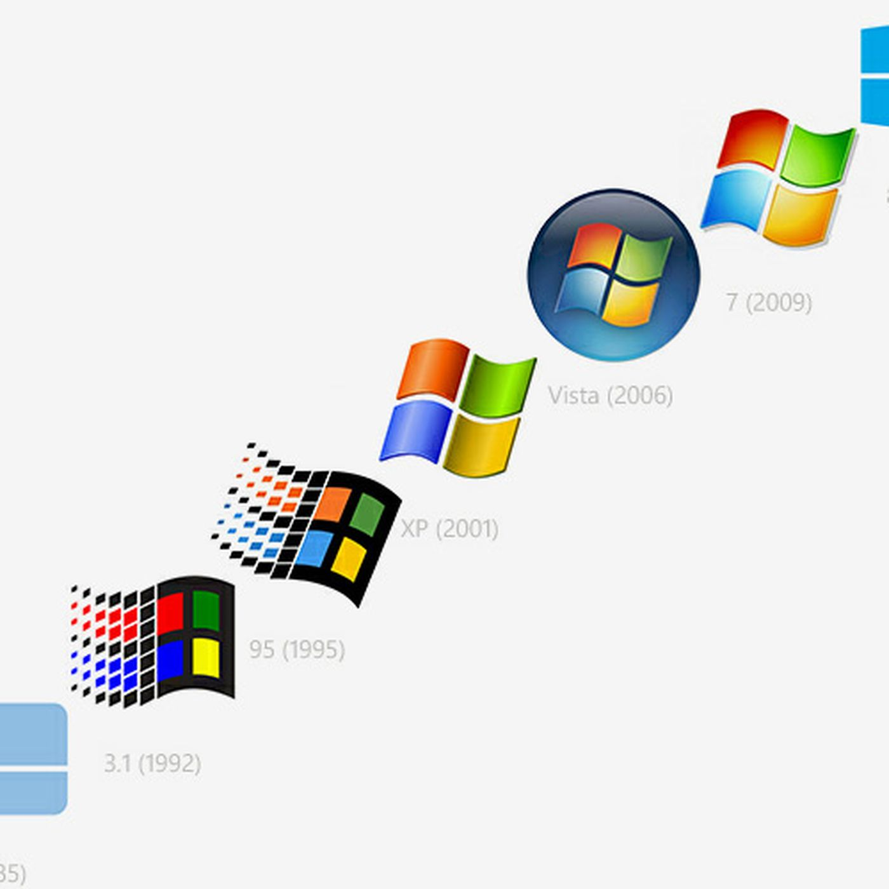

# Activate-Windows-8-8.1-10-and-11-Pro-for-Free
Activate Windows 8, 8.1, 10 and 11 Pro for Free
NOTE
If you see the Windows keyboard button <kbd></kbd> in this guide; and you can't find it on your keyboard, you likely have/had Windows 10 which has the button <kbd></kbd> . If you can't find that one, you likely have a PC that has been upgraded to Windows 8/8.1/10/11 from Windows 8.1/8/7/Vista/XP and other ones. If you have one of those, refer the Windows key button to as yours. A list of them is below:
- <kbd></kbd> - **Windows 11**
- <kbd></kbd> - **Windows 10**
- <kbd></kbd> - **Windows 8/8.1**
- <kbd></kbd> - **Windows XP/Vista/7**
- <kbd></kbd> - **Windows 95/98**

 This doesn't say that your PC currently runs an older version of Windows. It is just the logo from the Windows version it came with. Your PC can always be upgraded to a newer version of Windows if it runs 64-bit and has a good CPU and GPU.

## Why?
There are so many reasons why you want to upgrade! A few famous features which you provide of:

- BitLocker - Used to better secure your storage drive in case it is stolen or for any other reason.
- Remote Desktop - Used to access your PC from anywhere by enabling a connection to your device.
- Domain or Azure Active Directory - Used to make it possible to place the PC in a domain or use Azure Active Directory.

## CREATE A RESTORE POINT!!!
Create a restore point to make sure you can roll back if something doesn't work, or anything goes wrong. You can find a tool to easily do this below.

## Restore Point Tool
The Restore Point Tool is a good tool using Batch to create a Windows restore point automatically so that you can rollback to your previous Windows edition. If needed, you can later on restore to this point to make everything working again.

## Tool Usage
1. Download the tool from [here](https://github.com/dasiboyz/Activate-Windows-8-8.1-10-and-11-Pro-for-Free/blob/Coad/File/Windows%20Edition%20Restore%20Point%20Tool.bat). <br>
2. Run the file as administrator.
3. Wait some time. You will see some text that it is working on some things.
4. When it is done, it will prompt 'Create restore point done!'.
5. It will exit, and your restore point is created!

## Restore Procedure
1. pen Settings (Not Control Panel).
2. Go to 'Info' or 'Information'.
3. Go down until you see 'Advanced System Settings' at 'Device Specifications'.
4. Click on it.
5. Go to 'System Security' section.
6. Click on 'System Restore'.
7. Click on the box at 'Select a different restore point'.
8. Select the first restore point in the list.
9. Click on 'Next'.
10. Click on 'Complete'.
11. Wait until the process is done. It should now be restored to your previous edition of Windows!

## BACKUP YOUR CURRENT KEY!!!
Backup the activation key you are currently using. This is to make sure that if the process doesn't work, you can reinstall Windows/change the edition and enter your current key, so that you can access everything again. This only applies when:

- You have bought a key online.
- It isn't connected to your Microsoft Account and is no digital license. If you have a Microsoft account with a digital license, you don't need to worry.

## Use Third Method for PERMANENT Activation!
Third is for users with PERMANENT activation. This requires you to have a Microsoft account connected with Windows. Find it by [clicking here](https://github.com/dasiboyz/Activate-Windows-8-8.1-10-and-11-Pro-for-Free/blob/Coad/Activating%20Windows%20Pro%20Method/Method%203.md). **The first and second methods are NOT PERMANENT.**

## Note for Users with Unactivated Pro Edition
People which already have Pro, but not activated, can skip to this [step](https://github.com/dasiboyz/Activate-Windows-8-8.1-10-and-11-Pro-for-Free/blob/Coad/Activating%20Windows%20Pro%20Method/Method%203.md).

## I Get a Notification: ```Your Windows license will expire soon``` or Something That way. What Do I Do?
Don't worry. You need to run the script again, but a recommendation: **For users which used this guide to activate with the first or second method and now get this message everytime, use the third method to activate it forever. But it requires a Microsoft account. When using Windows 8 or Windows 8.1, the third method won't work.**

## Getting Started
1. What you first need to do is open CMD (Command Prompt) as Administrator by pressing <kbd></kbd> + R.
2. And now type in cmd.exe in the box
3. It should now look as something like this:
4. Now press the 3 keys `Ctrl` + `Shift` + `Enter`.
5. Now you should have something like this:
6. Now, click on `Yes`.
7. Now you have something like this:

## The Commands
1. Now, type the following command: `slmgr.vbs /upk`
**Note:** this will remove your current activation key!
2. Now it will give an message, click on `OK`.
3. And now this command: `slmgr.vbs /cpky`
4. It will give an message once again, and click on `OK` again
5. And now type this command: `slmgr.vbs /ckms`
6. Once again click on `OK` when you get a message

## Edition Upgradable Check Command
Now we are going to check whether your edition has support for upgrading to the Pro edition.
1. Run the following command to check this: `DISM /online /Get-TargetEditions`
2.  If you see `Professional` in the list, then you can upgrade your Windows edition to Pro for free!

## Running Windows Pro installer
1. Now, copy and paste this complete command:
   ```
   sc config LicenseManager start= auto & net start LicenseManager
   sc config wuauserv start= auto & net start wuauserv
   changepk.exe /productkey VK7JG-NPHTM-C97JM-9MPGT-3V66T
   exit
   ```
3. It will run an installer and you will see an message: `% complete`
4. Now wait until it's 100% and then you get an error (This is **normal**, this needs to happen)
5. When you get the error, just click `Exit` and then reboot your pc
6. You will now see a message that he is running updates and is installing features, just wait until its done and check `info` in settings, You will see that Windows 10/11 Pro is installed! **(May show Windows Enterprise, but will be Windows Pro!!)**.
   
   But we are not done yet, You will see that it isn't activated and that you can't change some settings, now we are going to fix that!

## Activating Windows Pro
Now we are going to activate Windows Pro for free. Choose one of the methods below. The third method is recommended, as this will activate it permanently. This requires you to have a Microsoft account associated with your device and make sure you run Windows 10 or Windows 11. The third method will not work on Windows 8 and Windows 8.1.

# Method 1 For Activating Windows Pro (Windows 8/8.1/10/11)
1. Now we are going to run some other commands to activate Windows 8/8.1/10/11 Pro
2. Press <kbd></kbd> + `R`
3. It looks like this again:
4. Press Ctrl + Shift + Enter
5. You will get a message, just click on Yes
6. Now you will get a command prompt
7. Type the following commands one for one to activate:
```
slmgr /ipk W269N-WFGWX-YVC9B-4J6C9-T83GX
slmgr /skms kms8.msguides.com
slmgr /ato
```
Note: This does not always work. When running `slmgr /ato` it does not always work, but keep trying. When it still doesn't work then, try one of the other methods below. If it was successful, you now have Windows 10/11 Pro and it activated! You can check settings to see it.


# Method 2 For Activating Windows Pro (Windows 8/8.1/10/11)
There's another method with a batch file.

1. Download it by [clicking here](https://github.com/dasiboyz/Activate-Windows-8-8.1-10-and-11-Pro-for-Free/blob/Coad/File/Activate_Windows_10_And_11_Pro_Free.bat).
2. It will start to download. `Click Save` (As) to save it. Now we need to open Windows Explorer. First, press the keyboard keys <kbd></kbd> + `R`. 
3. Type `explorer.exe` in the box and click `Enter` on your keyboard or click `OK`. 
4. Now it will open Windows Explorer. You're here now:
5. Click on `Downloads`, or go to the directory where you saved the downloaded batch file. Now you are here (or on a different place):
6. Click on the batch file once, then right click and click `Run As Administrator`. It will ask for UAC permissions. Click `Yes` now. Now a console windows will open. Wait until it says `<product activation succesfull>`. Now you activated Windows Pro for free! It also asks if you wanna see someone's blog. Press `Y` if you want to and `N` if you don't want to see.

# Method 3 for Activating Windows Pro Permanently (Windows 10/11)
Note: This method requires you to have a Microsoft account connected! This is the method most people may use as this one activates it PERMANENT. If the below steps aren't working, try to download the batch file manually (.cmd and .bat are both the same) from [here](https://github.com/dasiboyz/Activate-Windows-8-8.1-10-and-11-Pro-for-Free/blob/Coad/File/Windows.bat) by opening the link and pressing Ctrl+S to save the file. After that run the .cmd file manually as administrator and you're already at final step, 7!
1. Press <kbd></kbd> + `R` to open the Run menu.
2. Enter 'powershell' in the box of the Run menu.
3. Press `Ctrl` + `Shift` + `Enter`.
4. In the PowerShell window, enter the following command and press `Enter`: `irm https://get.activated.win | iex`
5. Wait until the window for the activation tool pops up.
6. Choose the option for HWID Activation by pressing the key associated with it.
7. Wait until it completes. It might give an SKU value error, but it will complete successfully. If it doesn't try again a few times and it should work.

# Last Words
I hope you enjoy it! 💖
